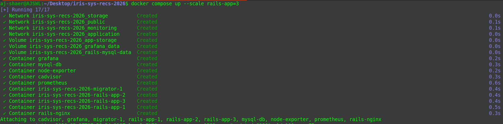
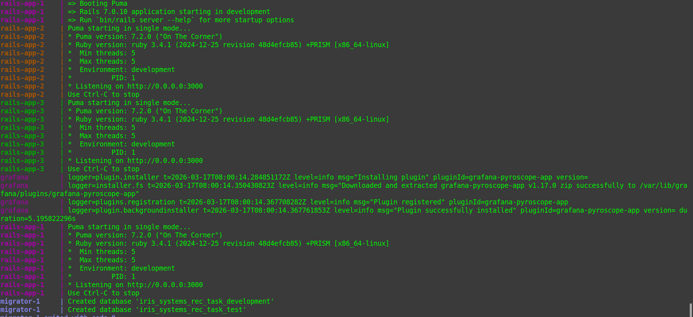
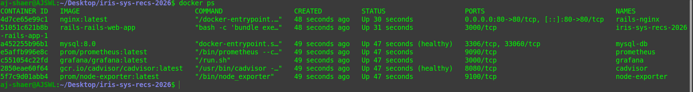
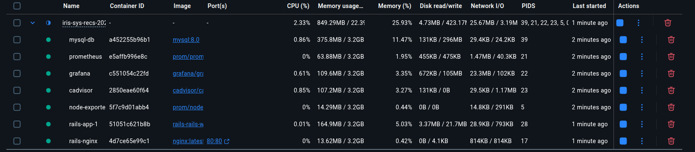
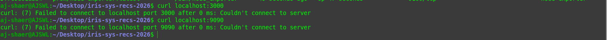
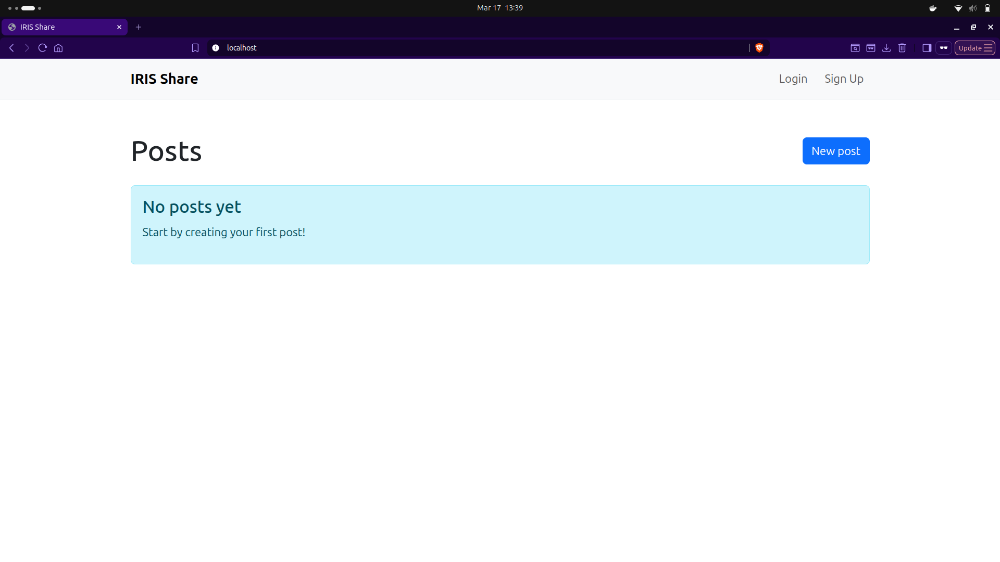

Environment:
- OS: Ubuntu
- Docker: 29.1.3

- branch: task-8 from origin/task8

Actions Taken:
1. Added new networks-application, storage, monitoring, public

2. Configuered the services' network to match the necessary network area and removed all the ports to prevent them from being exposed

3. Ran 

```bash
docker compose up --scale rails-app=3
```




4. Verified for the lack of any exposed ports and if all containers are running




4. Ran 

```bash
curl localhost:3000
curl localhost:9090
```

to see if the request fails



and verified that the app is running


