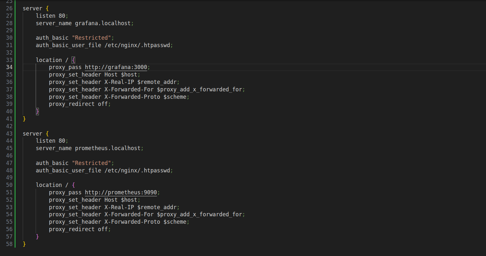
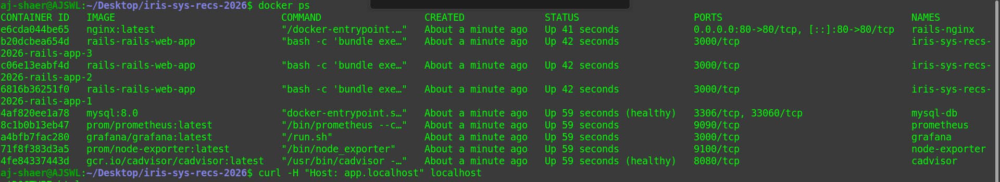
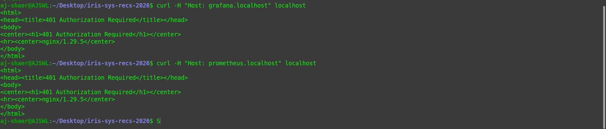
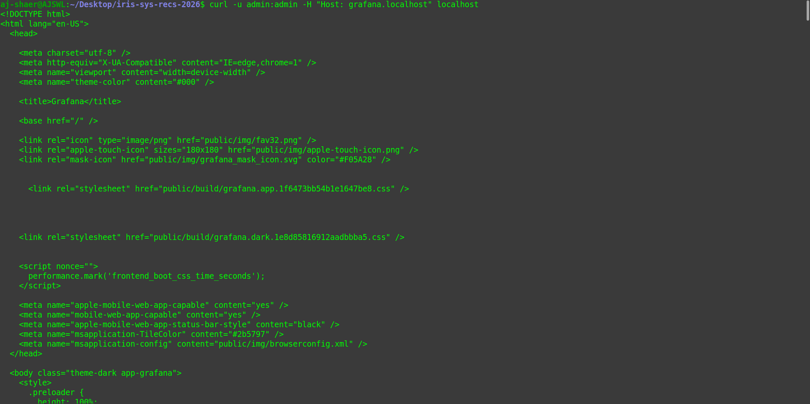

Environment:
- OS: Ubuntu
- Docker: 29.1.3

- branch: r2_task1 from origin/r2_task1

Actions Taken:
1. Added grafana and prometheus local host servers in nginx/default.conf file




2. Re-build the containers

```bash
docker compose up --scale rails-app=3
```



3. Verified the access to grafana.localhost and promethus.localhost



