Environment:
- OS: Ubuntu
- Docker: 29.1.3

- branch: r2_task1_2 from origin/r2_task1_2

Actions Taken:
1. Tried to add NFS server but was getting a "No route to host error".
   - Initially I got a mount error when i used hostname instead of a static IP, but when I used a static IP I got no route to host error
   - Then i tried to manually mount inside each rails-container and still got the same error, so instead of using a NFS I am using the normal share storage.
   - The disadvantage would be, I wont be able to deploy it on Kubernetes, since the current method is local-only

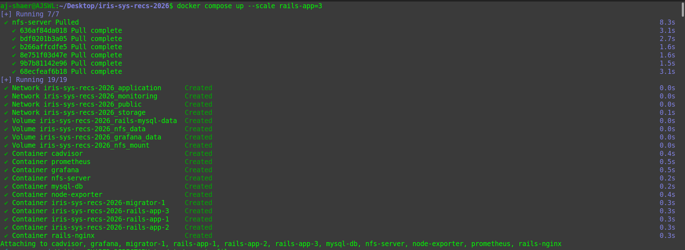
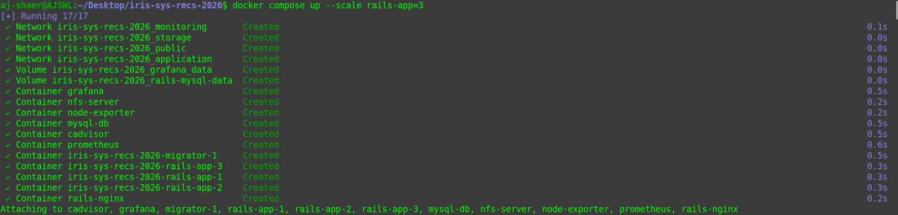
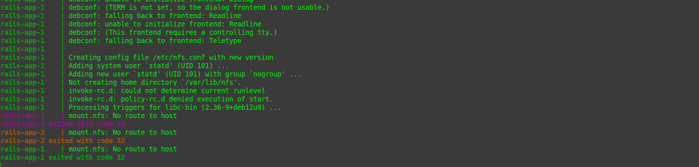
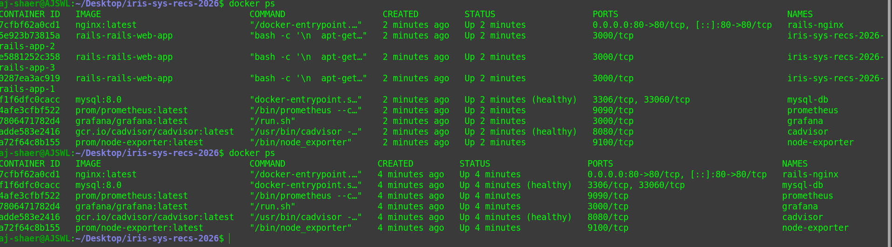
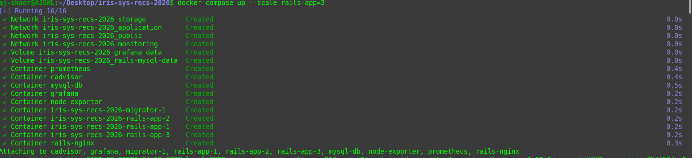
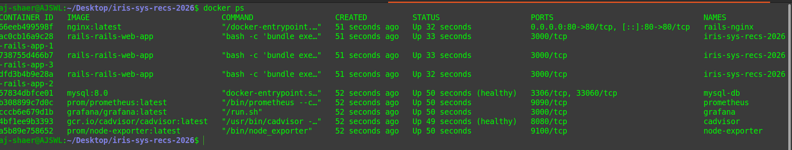
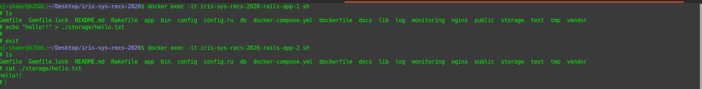
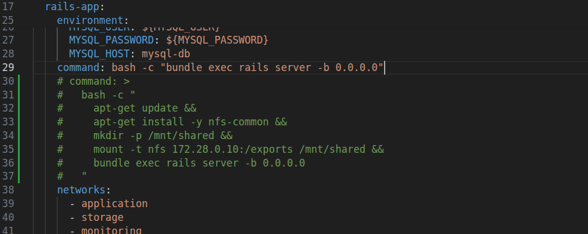
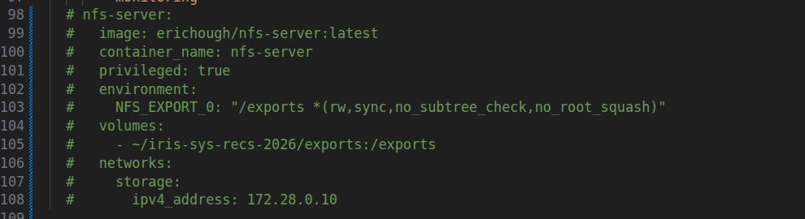
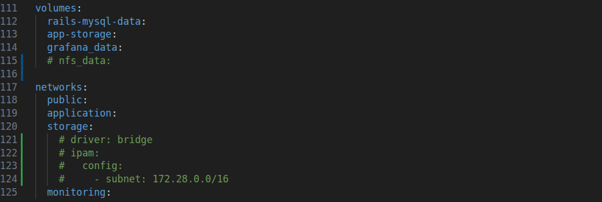


2. So I commented the NFS server out and rebuild the containers

```bash
docker compose up --scale rails-app=3
```

3. The other issue I fixed is the CSRF issue that I kept getting when I removed iphash from nginx container.
   - I did this by adding a Redis cache store to store the neccessary login info for that particular app session across all 3 containers

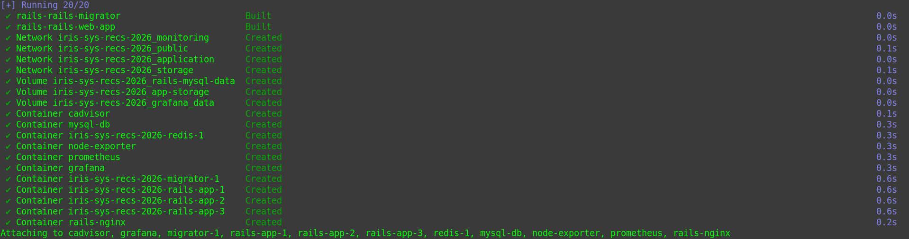
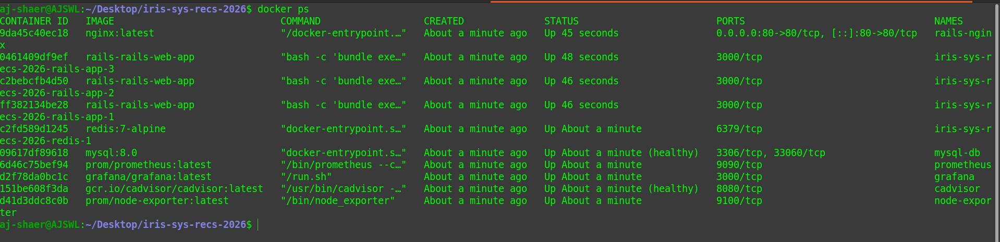
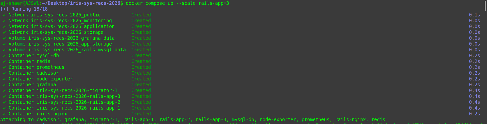
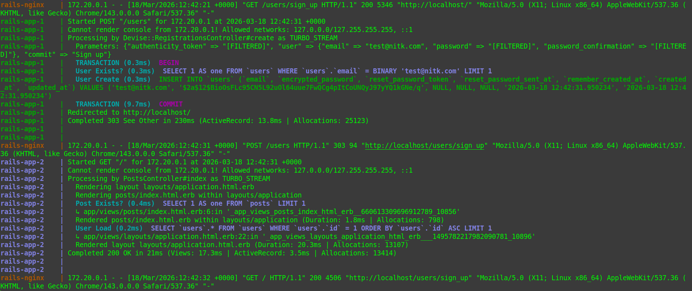
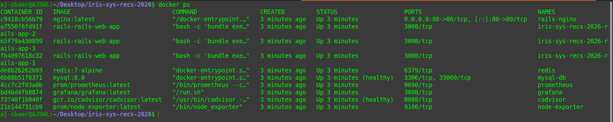
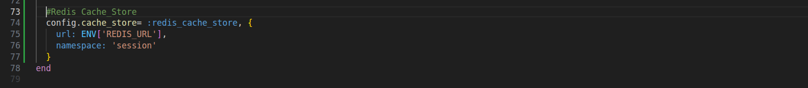
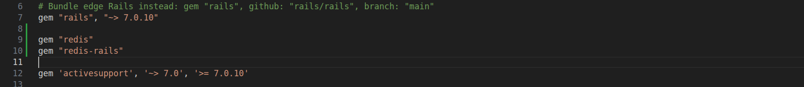
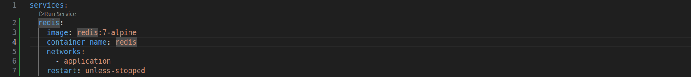
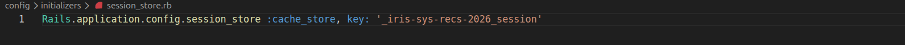