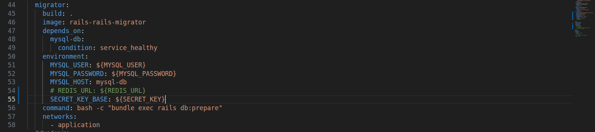
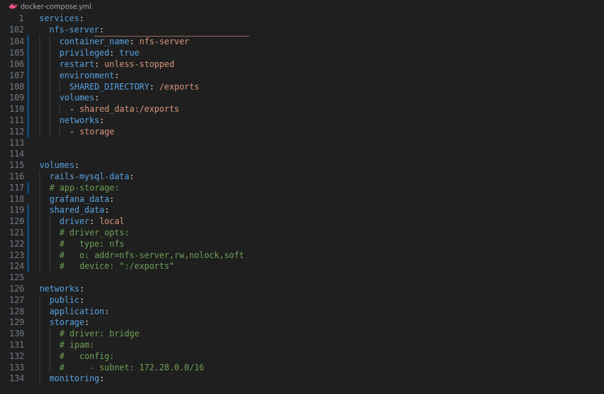
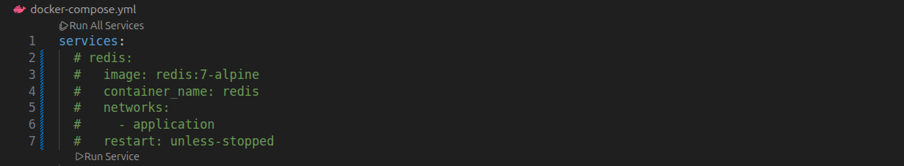
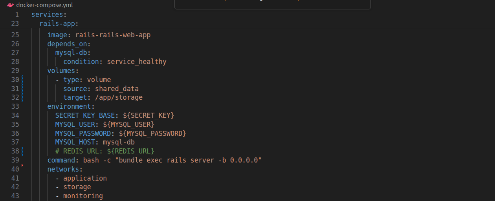
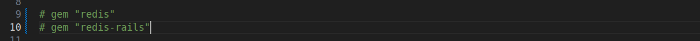
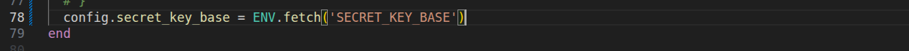
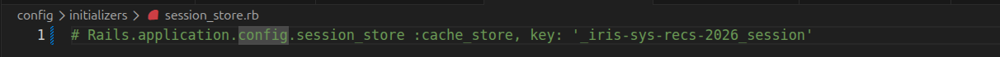
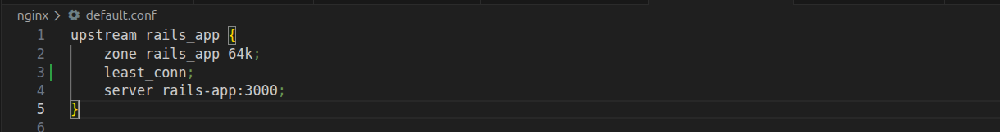
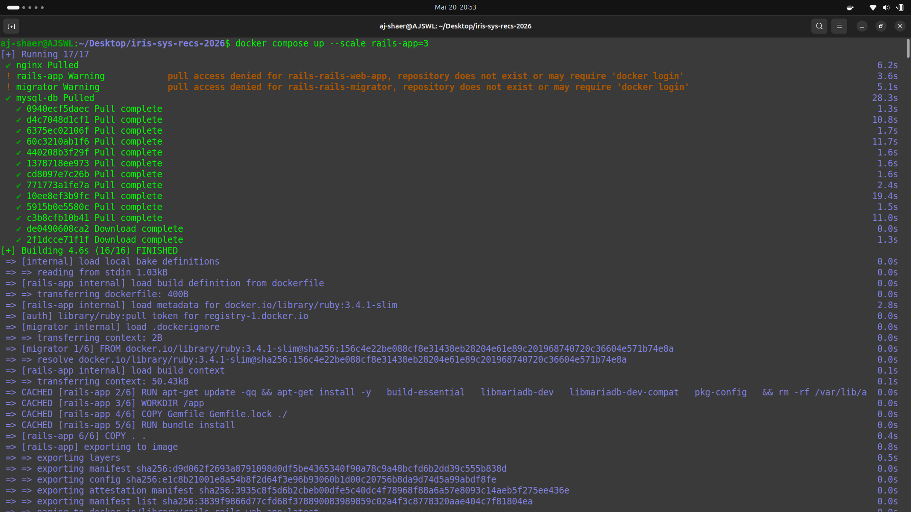
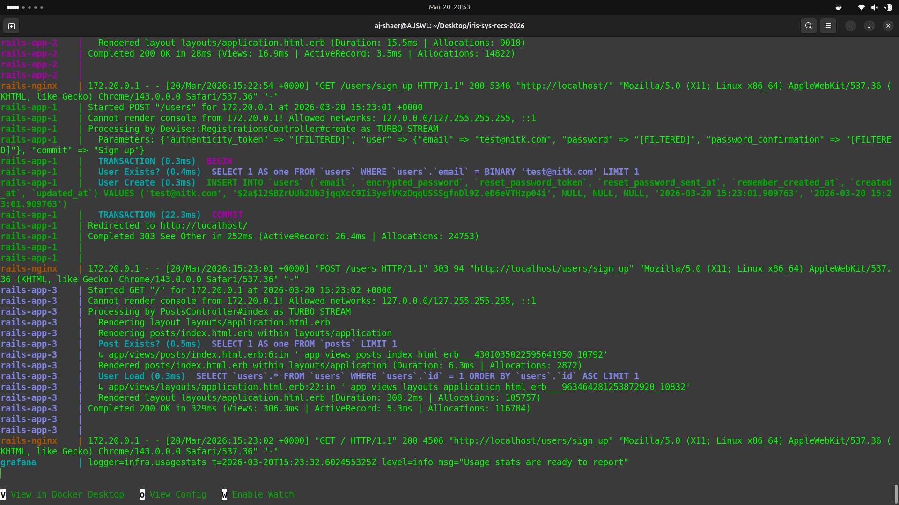

Environment:
- OS: Ubuntu
- Docker: 29.1.3

- branch: r2_task2_retried from origin/r2_task2

Actions Taken:
1. I retried the task2 again, after discussing the error I got with my friend and Chatgpt of where the NFS no route to host issue could be coming from, and realised that the error could be in the driver_opts so I commented it out.
   - I commented out the Redis part and added the SECRET_KEY_BASE environment variables to the neccessary files so that all the containers use the same key to basically sign and fetch the data stored in MySQL
   - The files I changed: nginx/default.conf, docker-compose.yml, Gemfile, development.rb, session_store.rb











2. I rebuild the rails-app image and spun up the containers

```bash
docker compose build
docker compose up --scale rails-app=3
```

3. The CSRF issue is now not there anymore.


