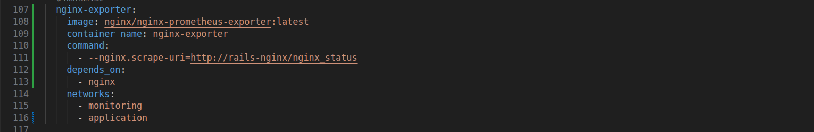
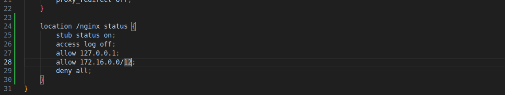
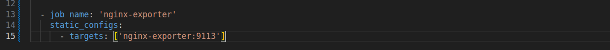
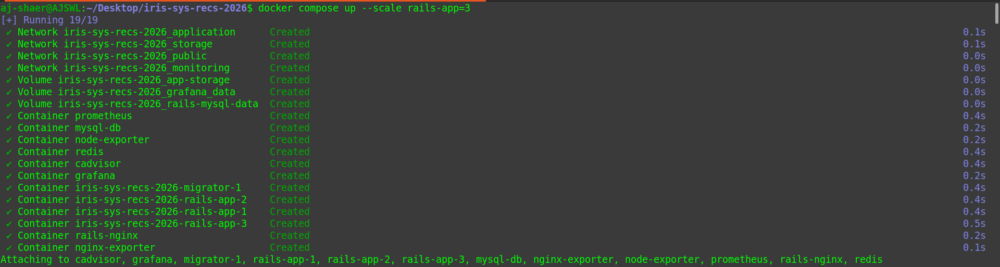
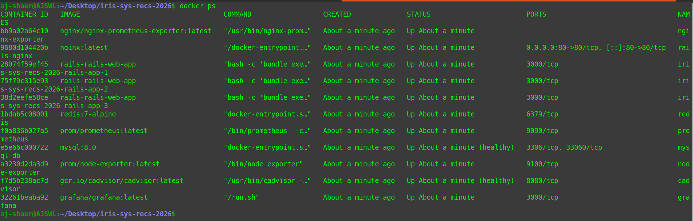
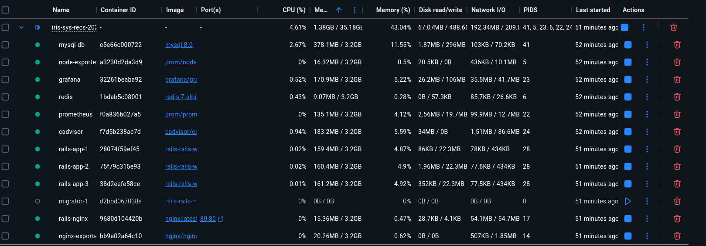
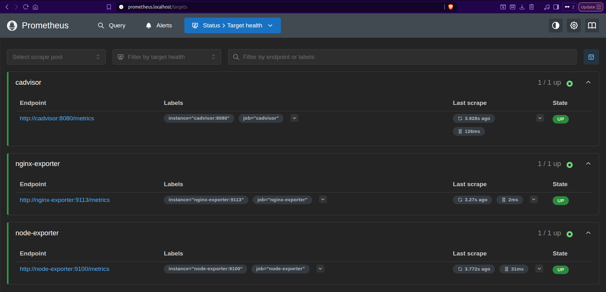
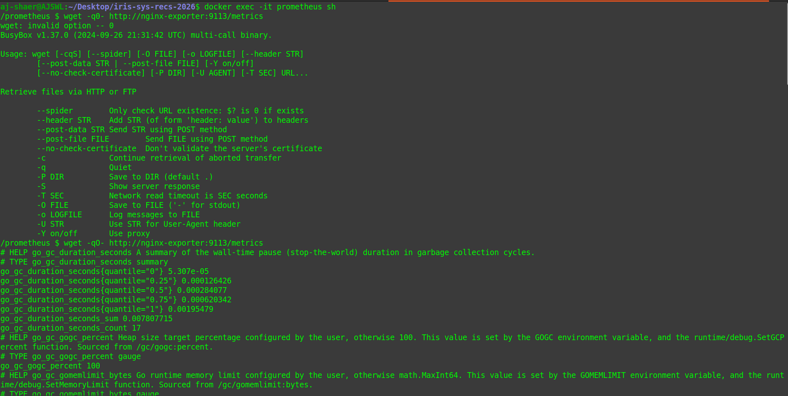
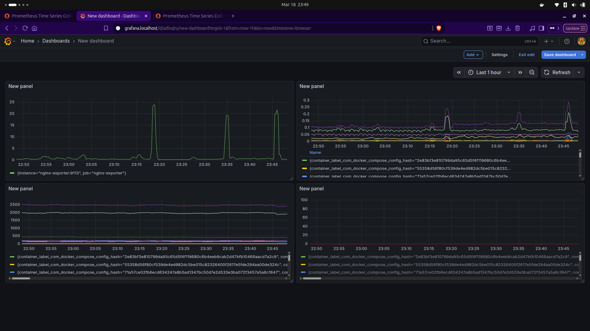

Environment:
- OS: Ubuntu
- Docker: 29.1.3

- branch: r2_task1_2 from origin/r2_task1_2

Actions Taken:
1. Set up nginx-exporter and nginx-status to export nginx metric to prometheus

 
 



2. Rebuild the containers and verified that grafana and prometheus ports arent exposed

```bash
docker compose up --scale rails-app=3
```





3.Verified prometheus scraping Nginx metrics, cAdvisor and Node Exporter and Grafana dashboards using the following queries

```promql
rate(container_cpu_usage_seconds_total[1m])
```
```promql
container_memory_usage_bytes / 1024 / 1024
```
```promql
changes(container_start_time_seconds[5m])
```
```promql
rate(nginx_http_requests_total[1m])
```




