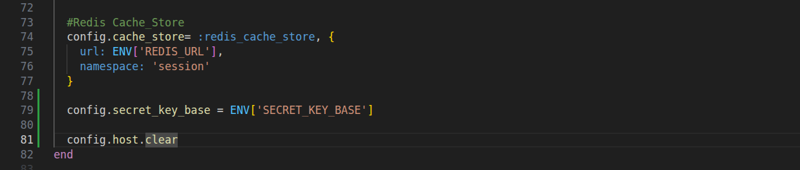
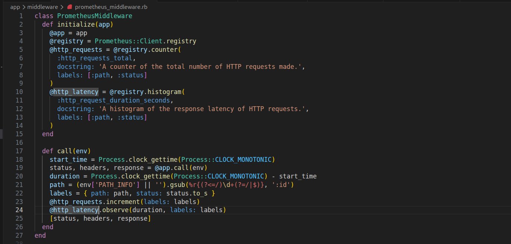
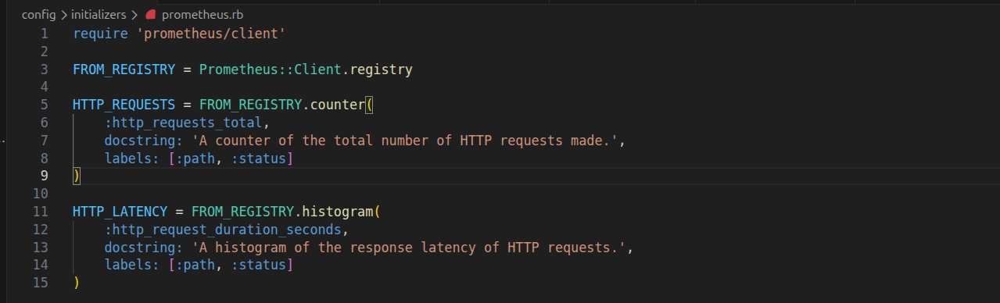
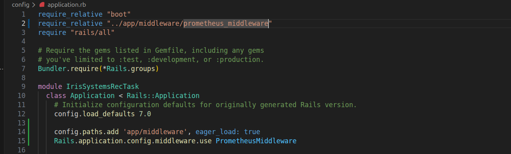
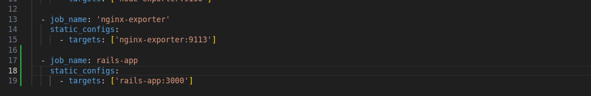
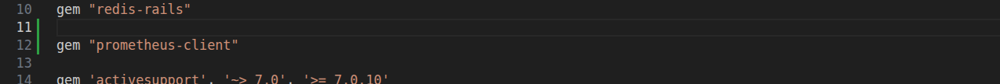
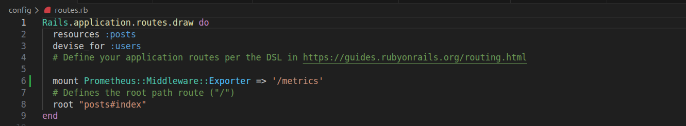
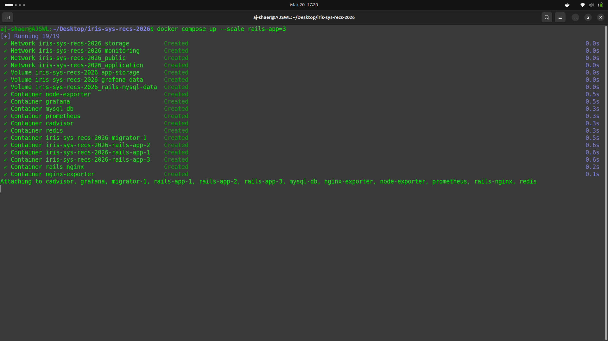
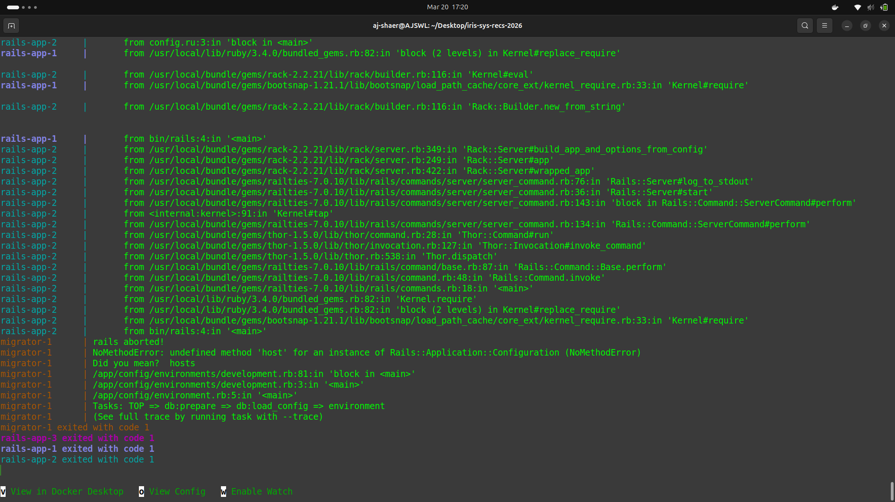

Environment:
- OS: Ubuntu
- Docker: 29.1.3

- branch: r2_task3 from origin/r2_task3

Actions Taken:
1. Set up prometheus metrics usign the prometheus-client by changing Gemfile, prometheus.rb, prometheus_middleware.rb, application.rb, devlopment.rb, prometheus.yml and routes.rb




 




2. Rebuild the image and the containers but kept running into "Kernel#Require" error stating that the PrometheusMiddleware class inside app/middleware/prometheus_middleware.rb was not found.

```bash
docker compose build
docker compose up --scale rails-app=3
```




PS: I tried to figured out a way to fix the error but was not able (would be interested to know what exactly the issue was cause I basically had a nightmare with this problem)