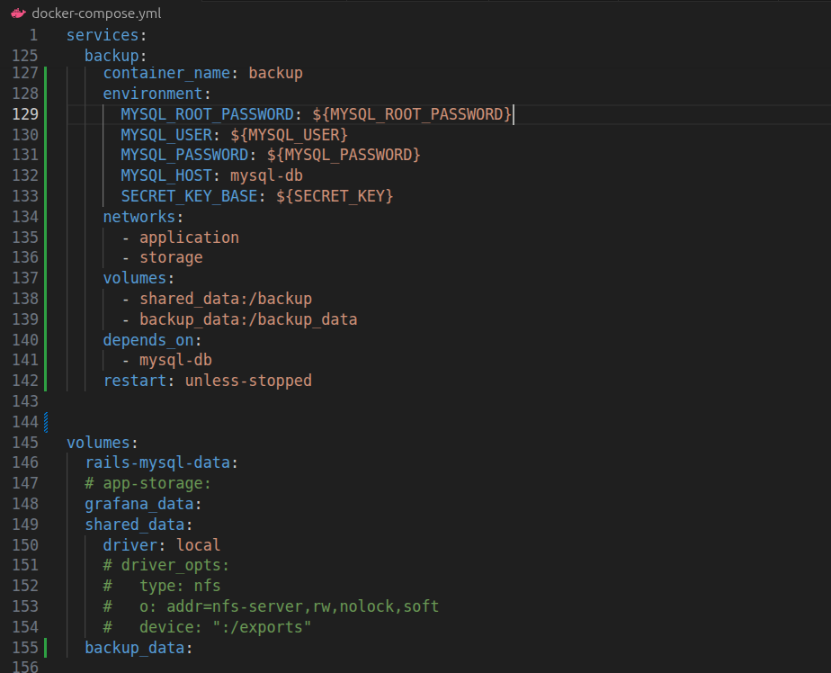
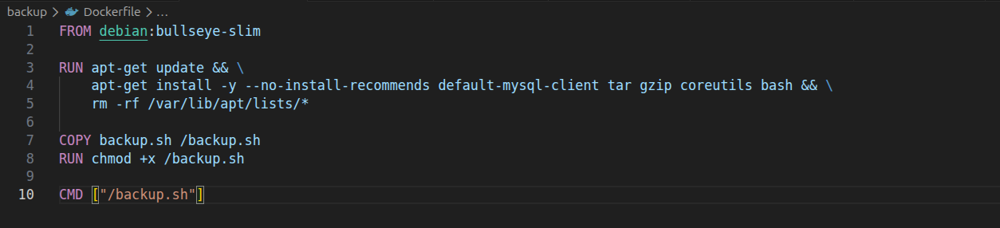
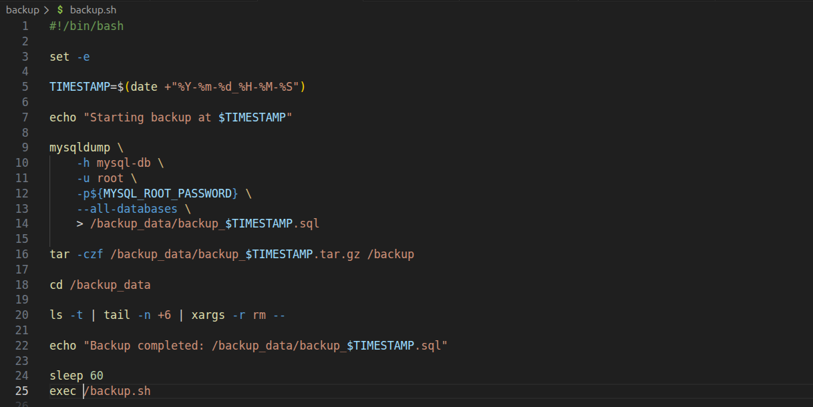
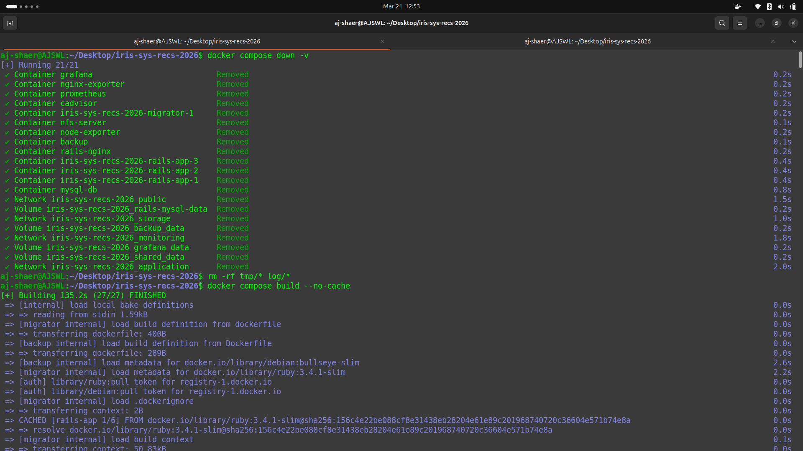
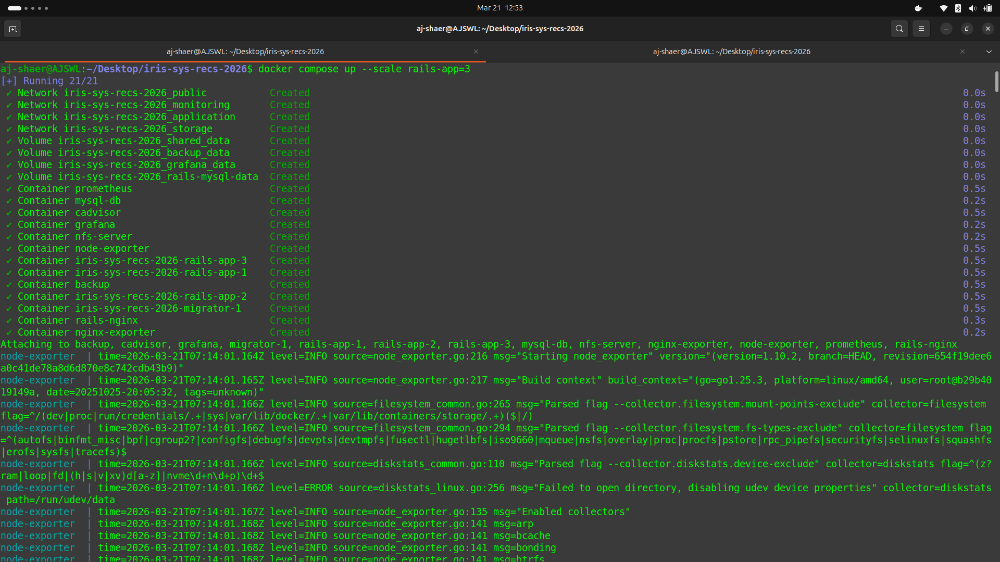
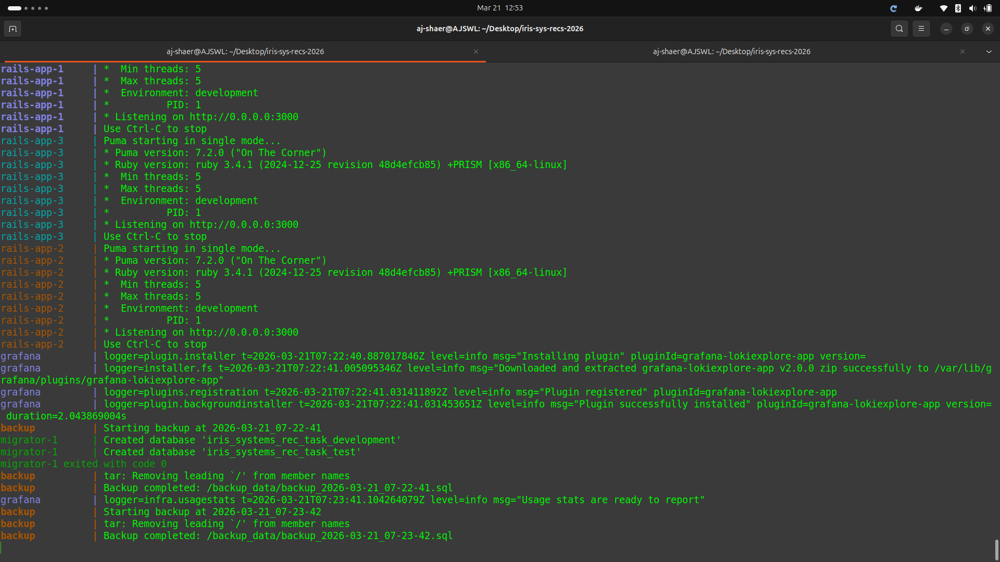
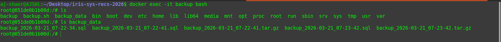
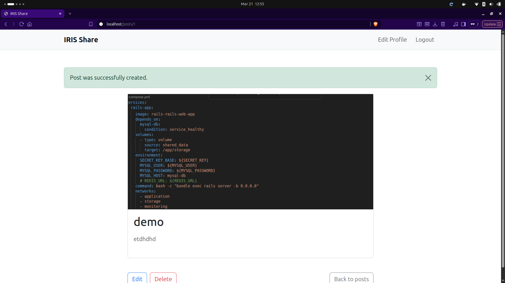

Environment:
- OS: Ubuntu
- Docker: 29.1.3

- branch: r2_task4 from origin/r2_task2_retried

Actions Taken:
1. Added a backup service to create a container and scripts and a dockerfile to create the backup image






2. I rebuild the rails-app image and spun up the containers

```bash
docker compose build
docker compose up --scale rails-app=3
```




3. The backup data exists (locally only for now so if the volumes are purged by "docker compose down -v" then all the backup is gone. this can be prevented by making a persistence by locally saving or saving it to a cloud)


