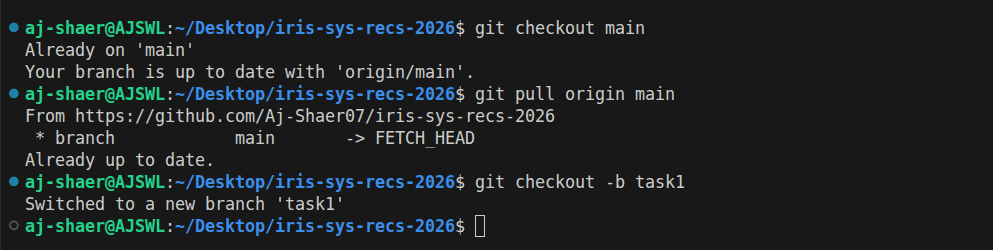
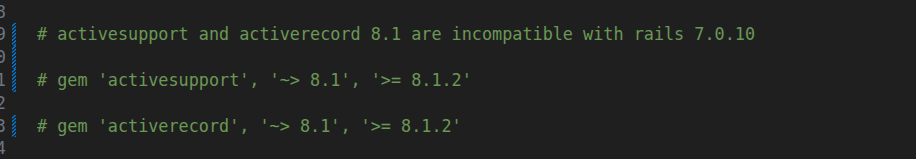
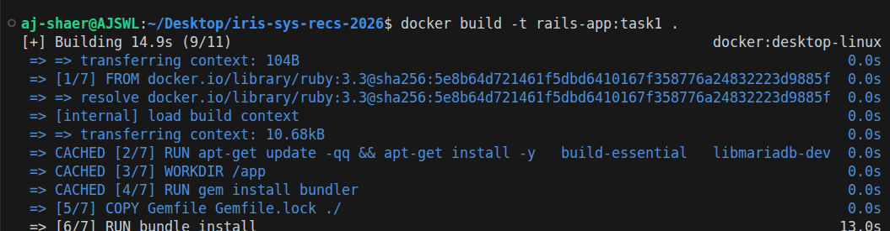
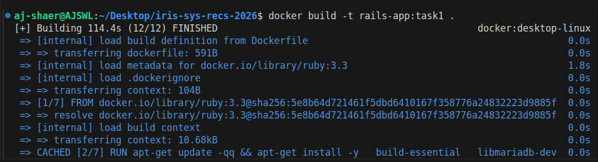
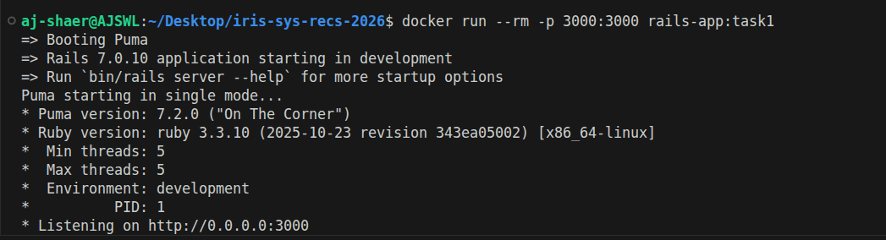
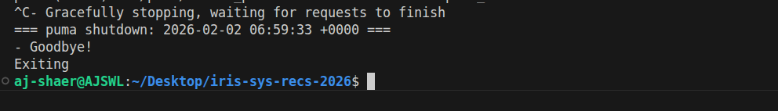

Environment:
- OS: Ubuntu
- Docker: 29.1.3
- Ruby: 3.3

- branch: task1 from origin/main

Actions Taken:
1. Corrected Gemfile for Rails 7 compatibility

2. Built Docker image using official ruby:3.3 image
 

3. Installed MariaDB client headers for mysql2 gem
4. Verified Rails boots inside container

