Environment:
- OS: Ubuntu
- Docker: 29.1.3
- Ruby: 3.3

- branch: task2 from origin/main

Actions Taken:

1. Created a private Docker network for internal communication between containers
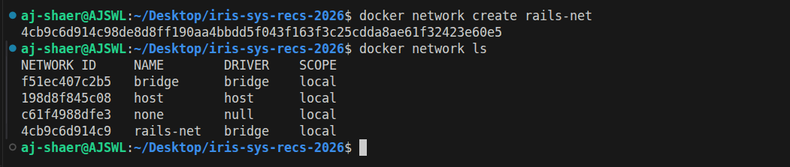

2. Launched MySQL database in a separate Docker container
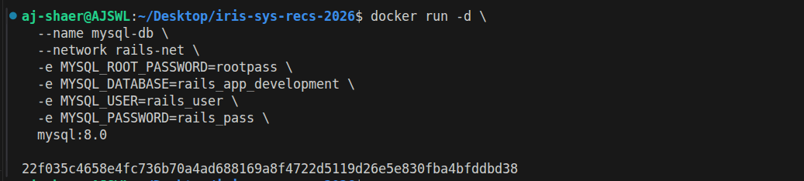
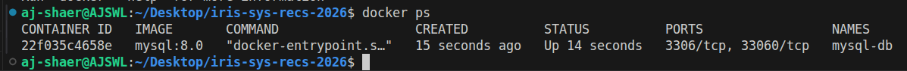

3. Updated database.yml to use environment variables and Docker network hostname

4. Built Rails Docker image using official ruby:3.3 base image
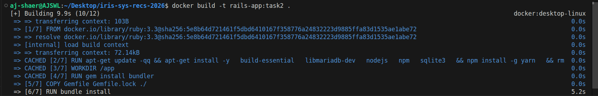
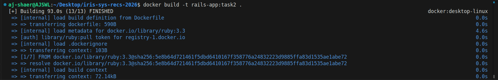

5. Launched Rails application container on the same Docker network as MySQL
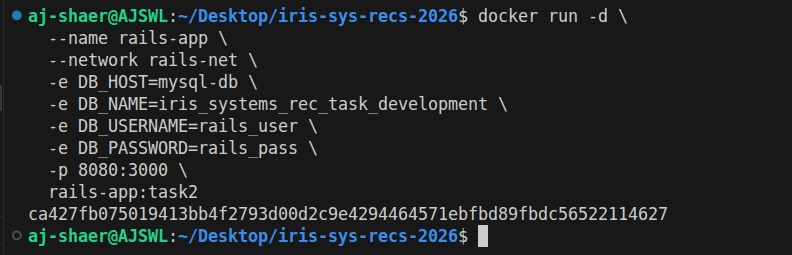

6. Exposed Rails application on host port 8080
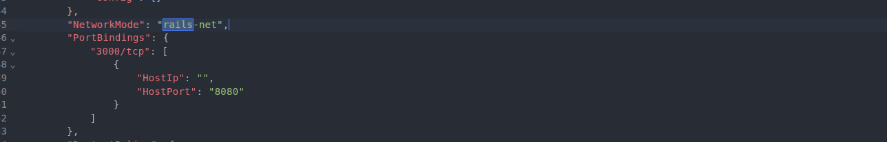

7. Verified Rails and MySQL connectivity via Docker network
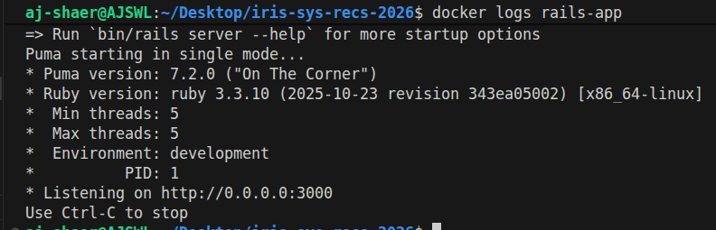

8. Verified that MySQL port is not exposed to the host machine
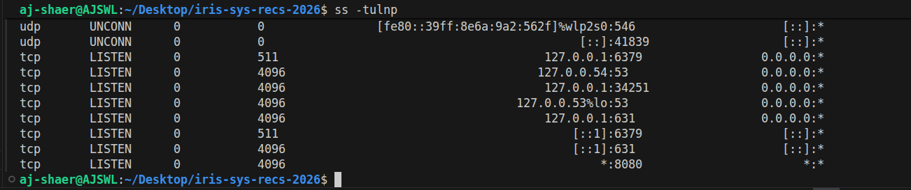

9. Rails successfully connected to the MySQL container but detected pending migrations on first startup.

Command executed:
```bash
docker exec -it rails-app bin/rails db:migrate
```

Then it worked
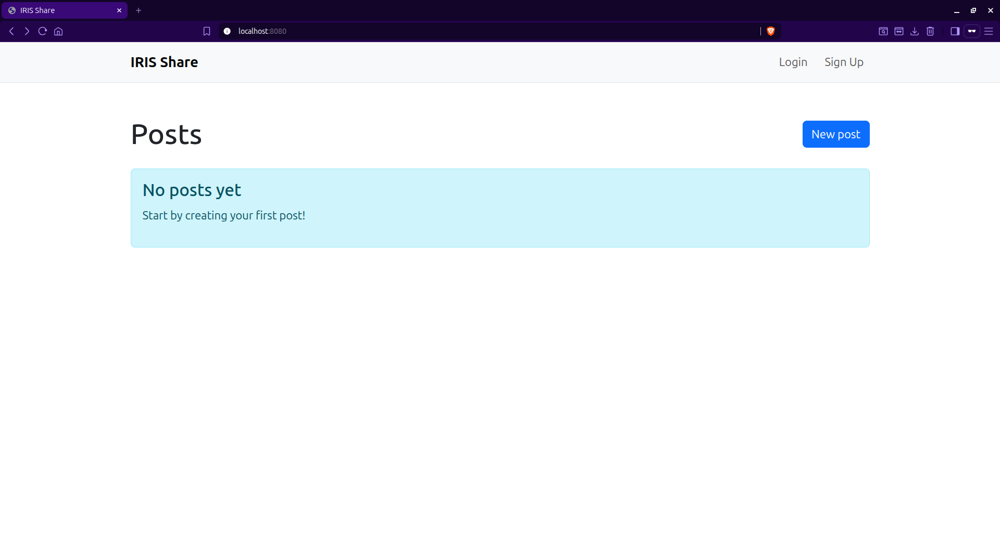
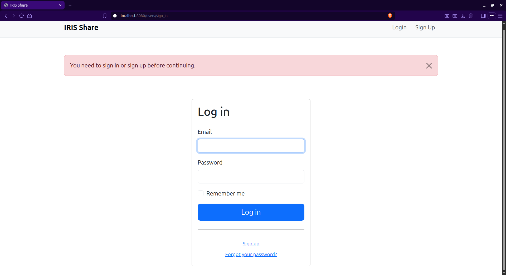


Dependencies:
- Dockerfile reused from task1 (branch: origin/task1)