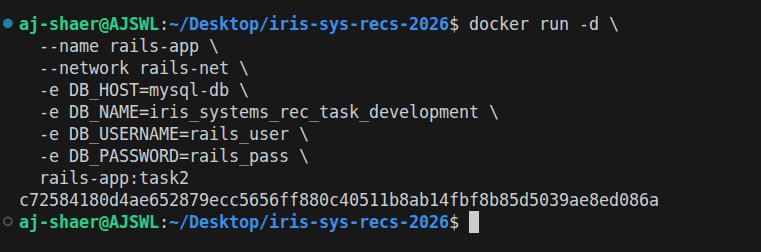
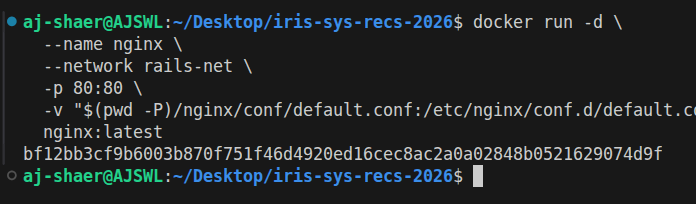
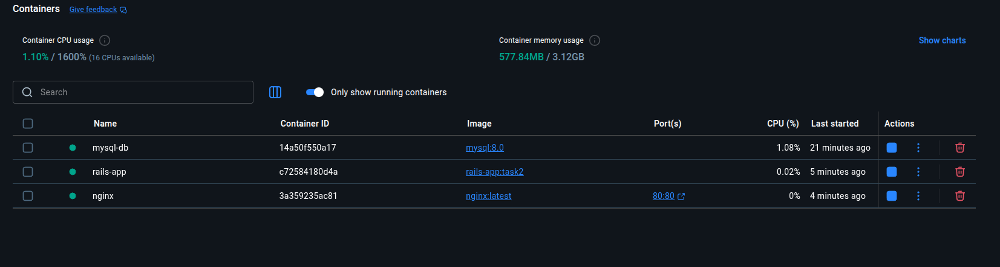
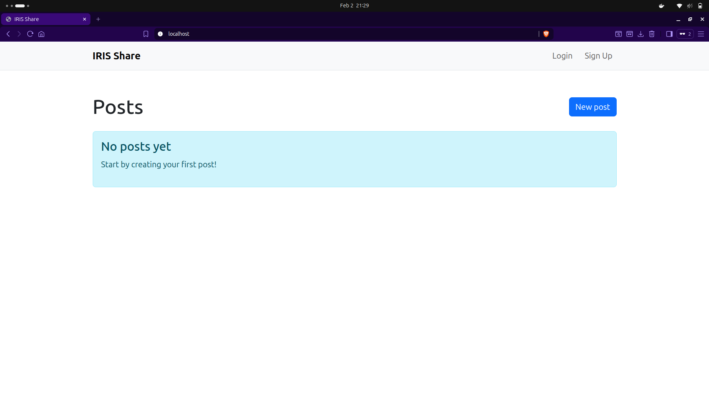
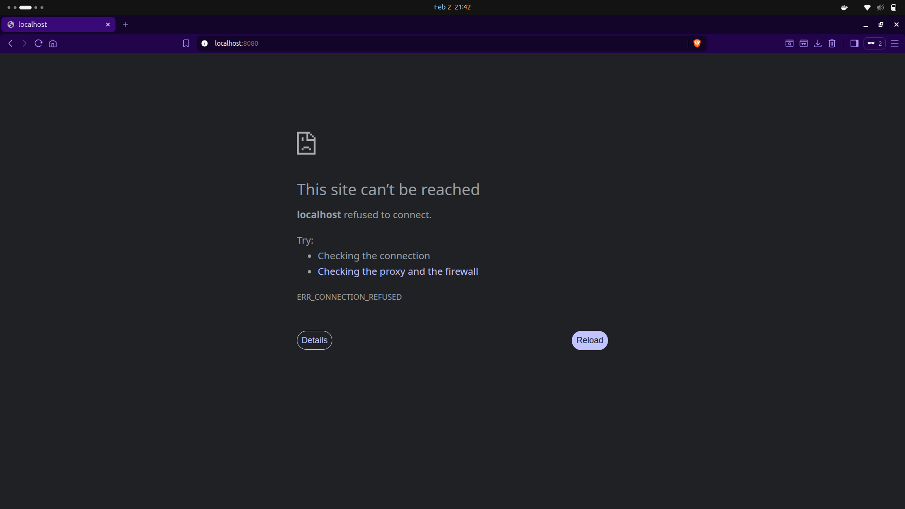
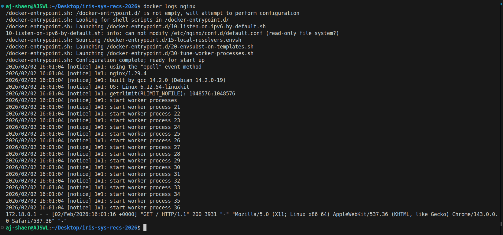
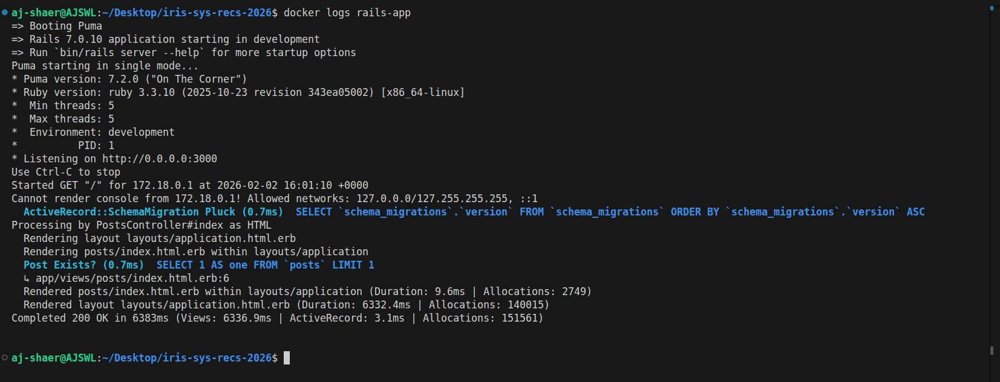

Environment:
- OS: Ubuntu
- Docker: 29.1.3
- Ruby: 3.3

- branch: task3 from origin/main

Actions Taken:

1. Added Nginx container as reverse proxy

2. Configured Nginx to proxy requests to Rails via Docker network

3. Removed direct port exposure from Rails container


4. Exposed Nginx on port 80                            


5. Verified application accessible only via Nginx




6. Verified the logs using 

```bash
docker logs nginx
docker logs rails-app
```




Dependencies:
- Dockerfile reused from task1 (branch: origin/task1)
- config/database.yml from task2 (branch: origin/task2)
