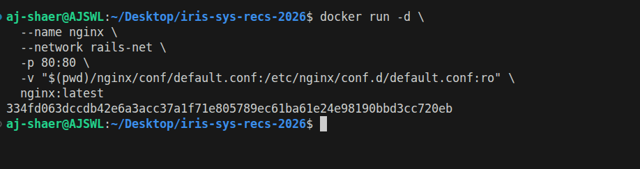
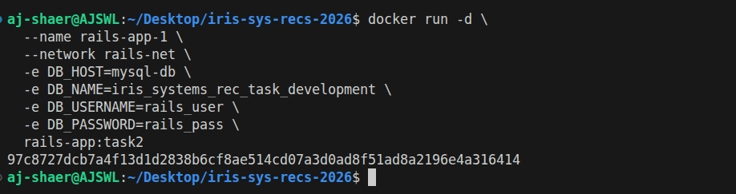
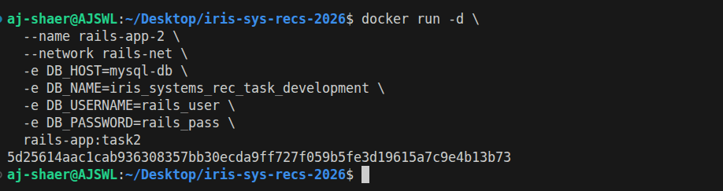
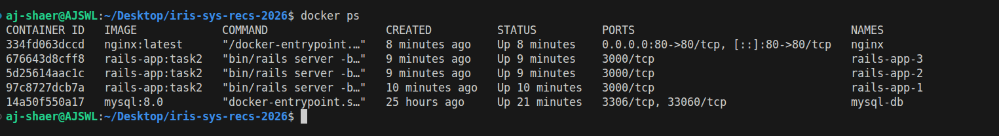
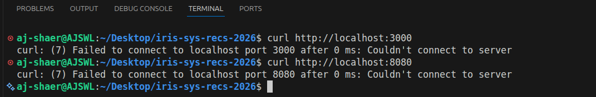
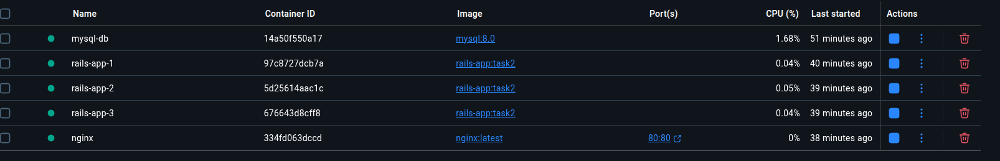
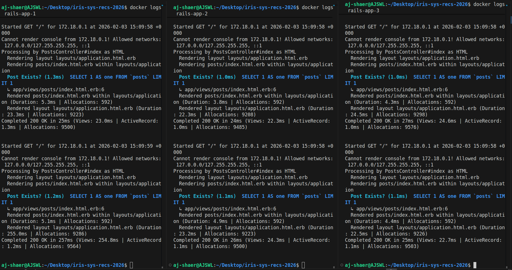
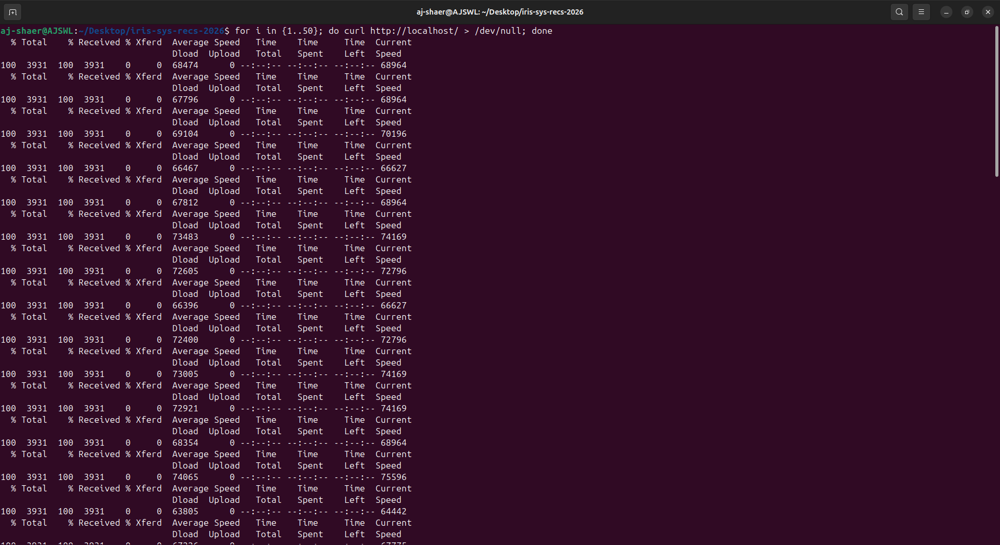

Environment:
- OS: Ubuntu
- Docker: 29.1.3

- branch: task-4 from origin/task3

Actions Taken:
1. Configured Nginx upstream for load balancing

2. Launched three Rails containers on private Docker network

3. Connected all Rails containers to single MySQL instance

4. Exposed only Nginx on port 80

5. Verified load balancing across Rails containers

