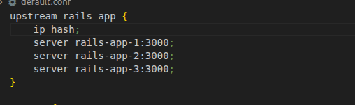
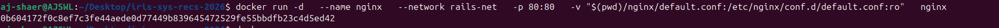
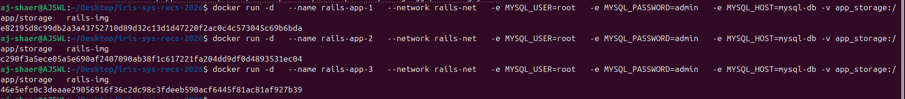
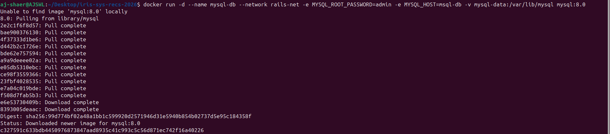
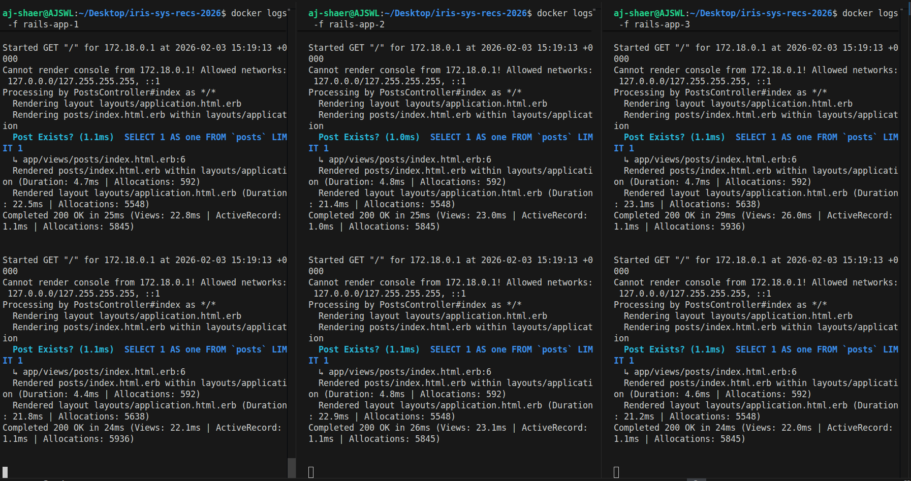

Environment:
- OS: Ubuntu
- Docker: 29.1.3

- branch: task-4 from origin/task3

Actions Taken:
1. Configured Nginx upstream by adding ip_hash to prevent CSRF authentication error

2. Launched three Rails containers and added a volume at /app/storage to prevent elements loading errors that might occur when loading images after refreshing the webpage.

3. Launched mysql container with  persistence                        

 

5. Verified user can signup and login without issues and data remains in the database even after stopping the containers and restarting them.

