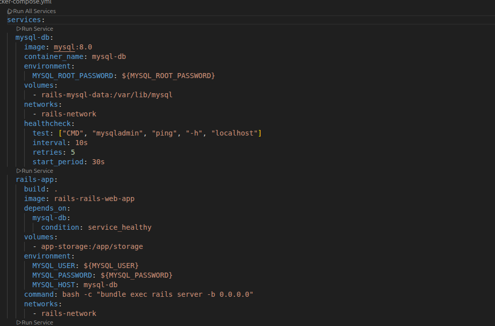
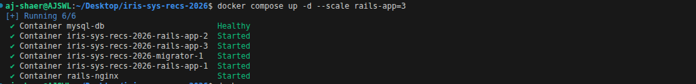
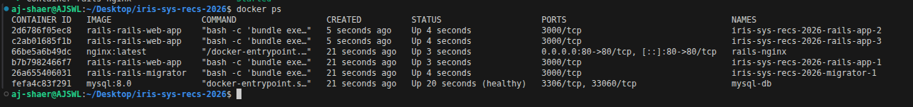
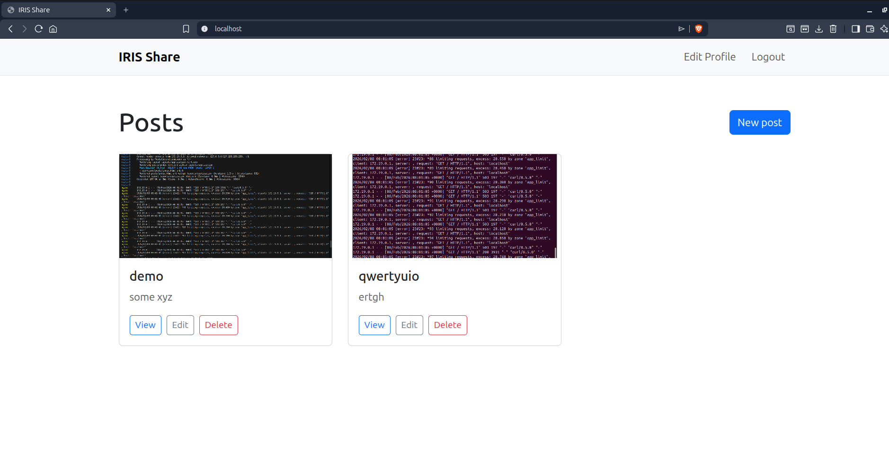
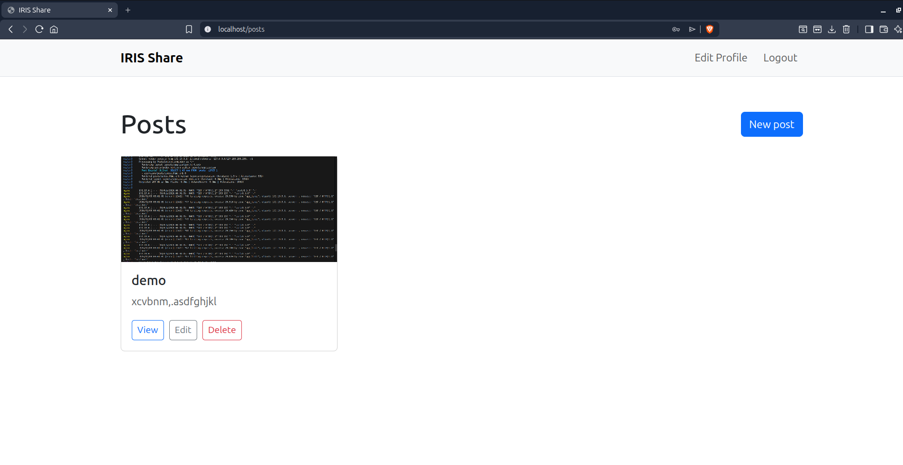

Environment:
- OS: Ubuntu
- Docker: 29.1.3

- branch: task-4 from origin/task3

Actions Taken:
1. Configured a docker compose file to set up everything with one command



2. Executed the docker-compose command

```bash
docker compose up -d --scale rails-app=3
```



3. Verified everything is running

 

4. Verified user can signup and login without issues and data remains in the database even after stopping the containers and restarting them.


