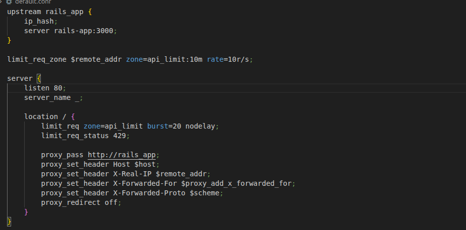
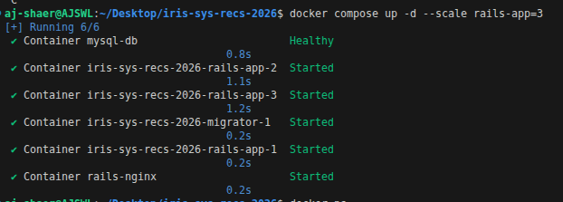
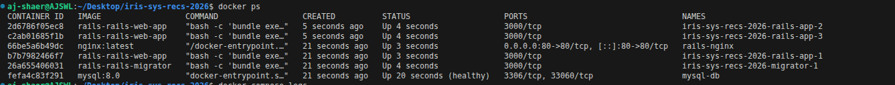
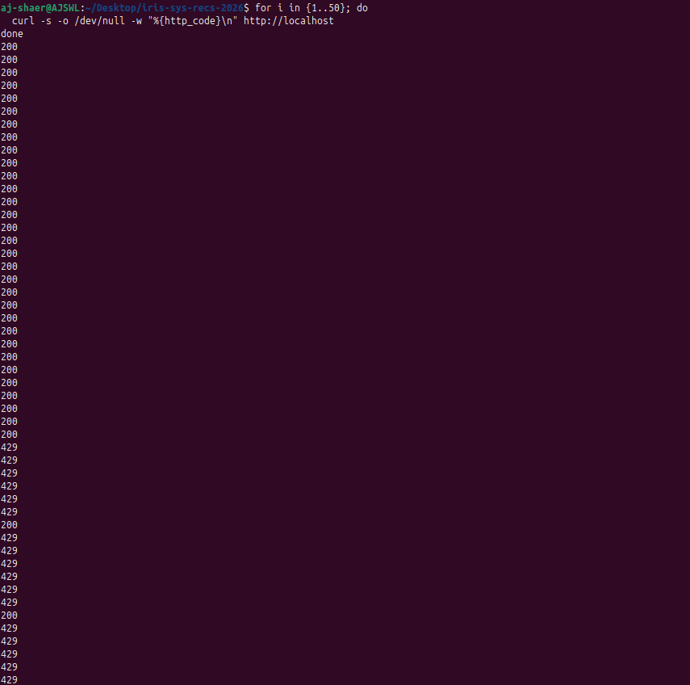

Environment:
- OS: Ubuntu
- Docker: 29.1.3

- branch: task-4 from origin/task3

Actions Taken:
1. Configured Nginx to limit no.of requests sent from one ip address



2. Launched the containers again using docker compose (could have restarted nginx with the command

```bash
docker restart nginx
```

)




3. Verified no.of requests sent from an ip cannot be more than rate per sec + bucket (10 + 20)                       




