Environment:
- OS: Ubuntu
- Docker: 29.1.3

- branch: task-4 from origin/task3

Actions Taken:
1. Added Prometheus, cAdvisior (for per container log) and Grafana services in the docker compose file

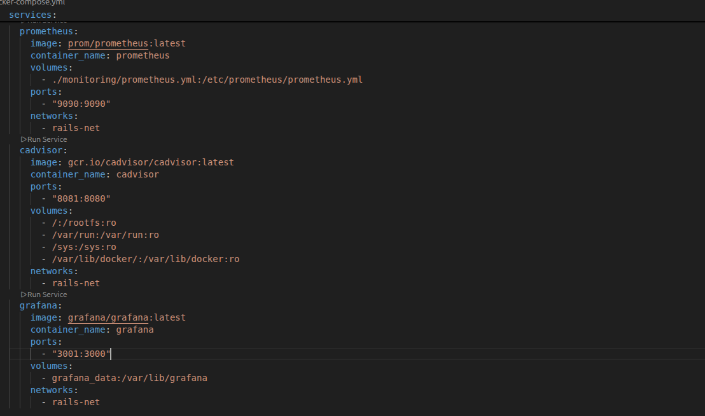

2. Configuered the prometheus.yml file to scrape infomation from node-exporter and cAdvisior

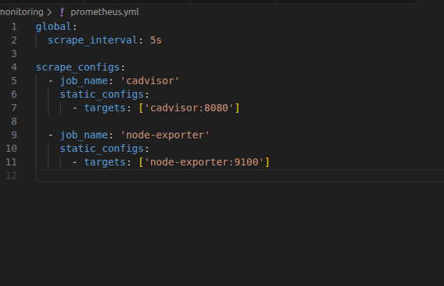

3. Ran 

```bash
docker compose --build
```

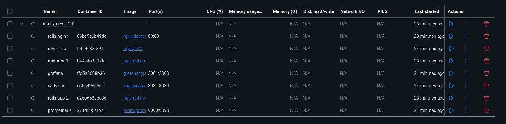

and verified prometheus and grafana are accessible and configured graffana to get data from prometheus


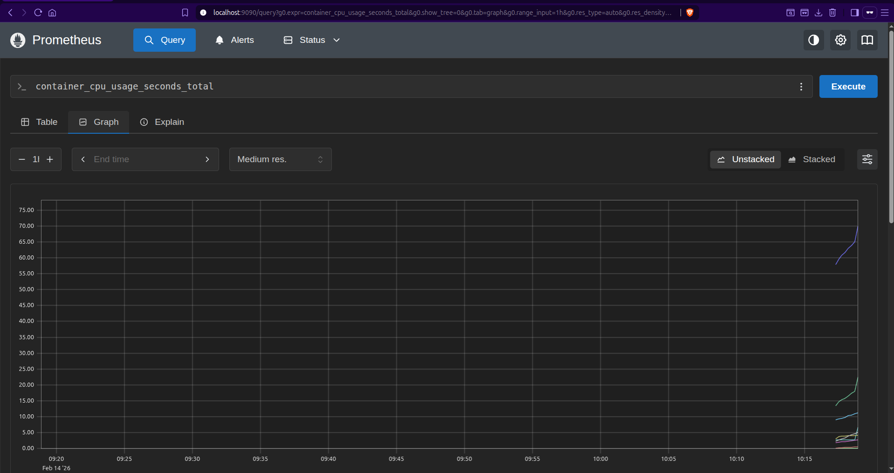
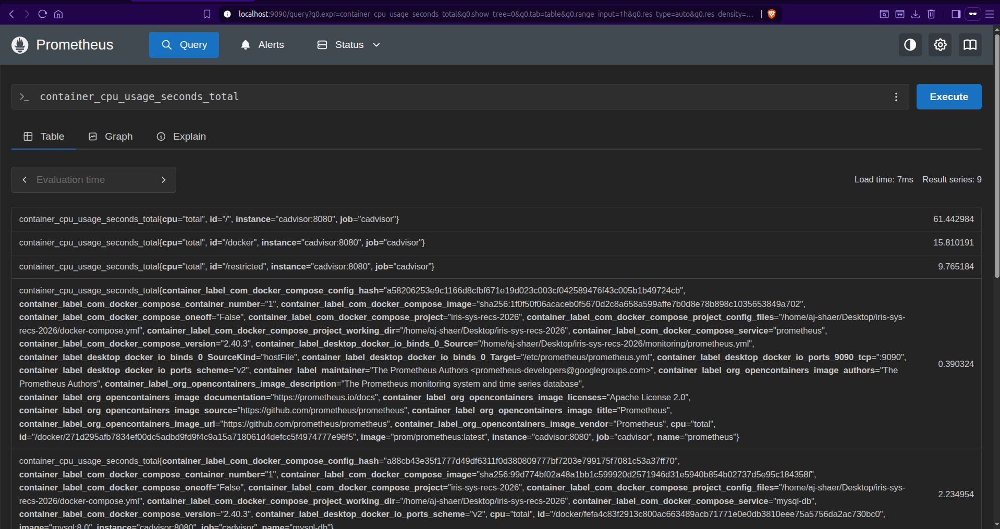
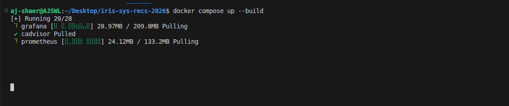

4. Ran 

```bash
for i in {1..500}; do   curl -s -o /dev/null -w "%{http_code}\n" http://localhost; done
```

twice to mimic load and got following results.

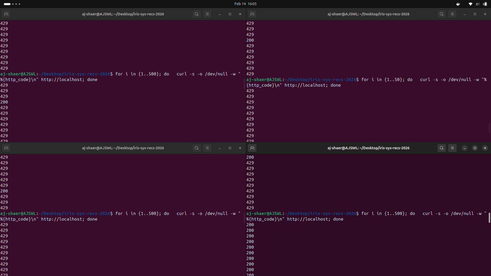 
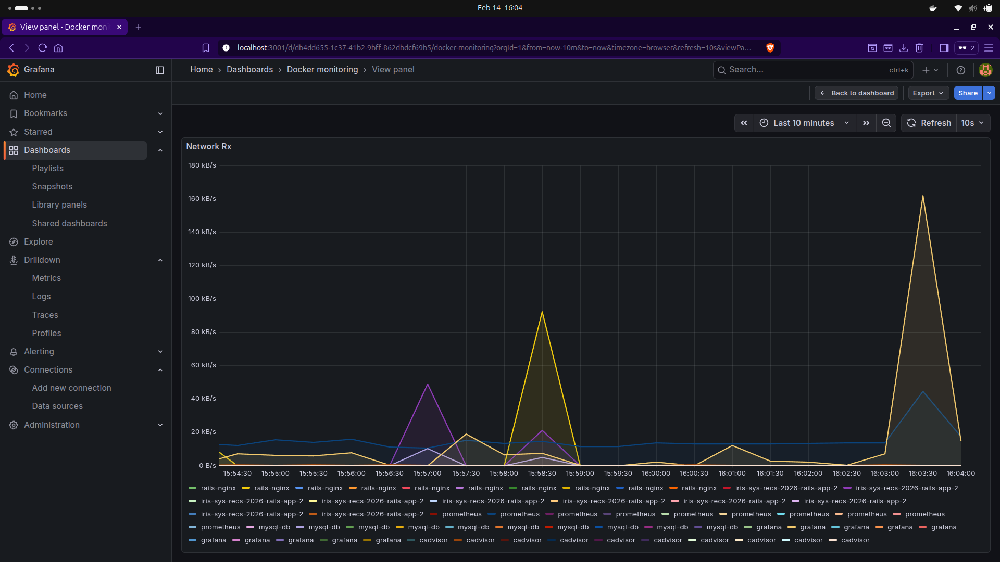 
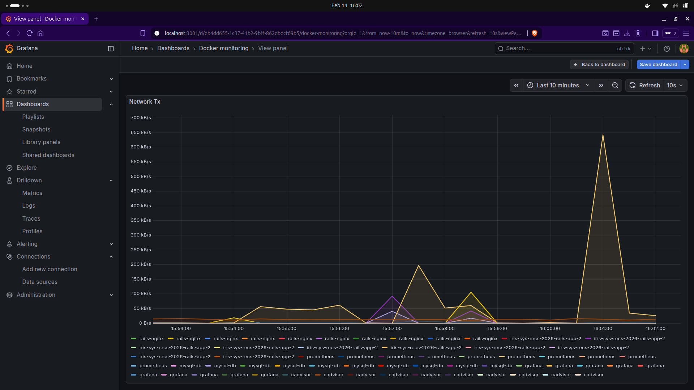 
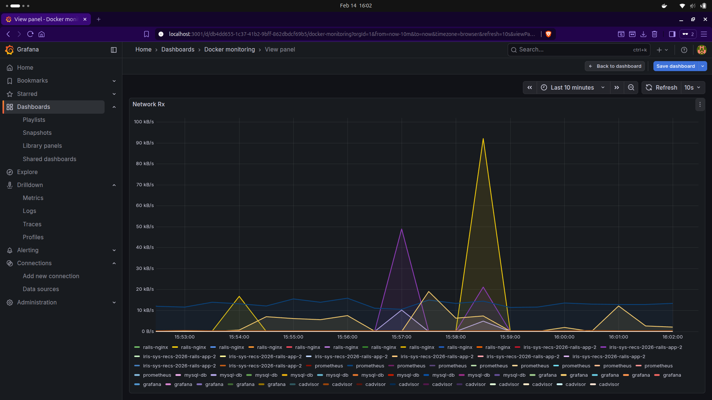 
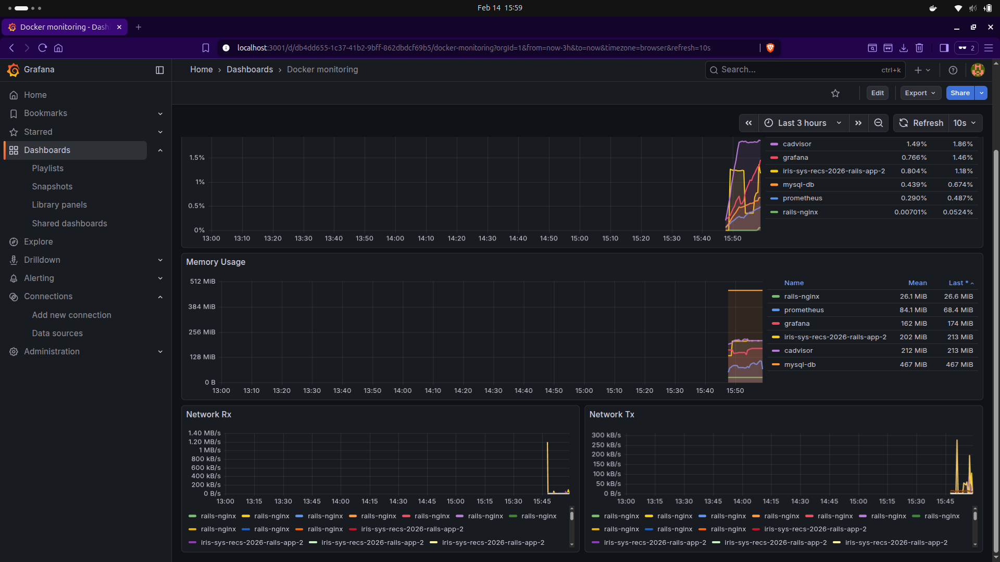

Note: The CPU load was pretty constant since the SQL query is very simple and the curl request are not concurrent
